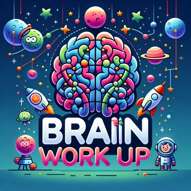

# Neurodevelopmental Services

Pediatric neuropsychological evaluations in Los Angeles for ADHD, autism, dyslexia, and other neurodevelopmental concerns in children and adolescents.

## Deep-Dive Into Child and Adolescent Neurocognitive Evaluation

Below we describe the comprehensive pediatric neuropsychological services that our clinic offers. With a specialization in ADHD in general and in girls in particular, autism, dyslexia, OCD and perfectionism, and a broad variety of other common (and rare) neurodevelopmental evaluations, we cater to a wide range of needs. We will walk you through our child-centered, evidence-based approach that focuses on detailed assessments and personalized care, and our commitment to working in collaboration with families and educators to support each child’s unique developmental journey.

> **IMPORTANT:**
>
> Across these age groups, our evaluation can be used to determine the existence and/or severity of major neurodevelopmental disorders.

## Services adapted for each age group

- [Preschoolers and young children](../preschool/index.llms.md)
- [School-age children and tweens](../school-age/index.llms.md)
- [Adolescents, teens, and high schoolers](../adolescent/index.llms.md)

## Pediatric Neuropsychological Services

- [Learning problems (e.g., dyslexia)](../dyslexia/index.llms.md)
- [ADHD](../adhd/index.llms.md)
- [Girls and teens with ADHD](../adhd-in-girls/index.llms.md)
- [Testing and academic accommodations](../testing-accommodations/index.llms.md)
- [Autism spectrum disorders](../autism/index.llms.md)
- [Social-emotional problems and executive functioning difficulties](../executive-function/index.llms.md)

### Other common concerns requiring pediatric neuropsychological services

- IQ testing and giftedness
- Testing for cognitive delays and intellectual disability
- Traumatic brain injury (TBI) and concussion
- Mood disorders such as depression
- Anxiety
- OCD and perfectionism
- Neurological changes

## Comprehensive Neurodevelopmental Evaluations

We offer exhaustive neuropsychological evaluations for a range of neurodevelopmental and behavioral disorders. These evaluations are instrumental in understanding a child’s cognitive, academic, and social-emotional functioning. We provide detailed reports and personalized recommendations to support children in their developmental journey.

## Our Unique Approach

> **TIP:**
>
> Our unique approach to evaluation is child-centered and family-focused. We realize that each child is different, and therefore we customize our assessments to meet their specific needs. Our team works collaboratively with families, educators, and other professionals to ensure a supportive and integrated approach to care.

## Our Unwavering Commitment to Excellence

We are committed to staying up-to-date with the latest research and advancements in pediatric neuropsychology. Our dedication to providing the highest quality of care ensures that each child we serve receives the support and guidance they need to succeed.

## Get in Touch

To know more about our pediatric neuropsychological services or to schedule an appointment, please feel free to contact us. We look forward to partnering with you and your child on their developmental journey. Stay tuned to our blog for more insights into pediatric neuropsychology and expert guidance for your child’s cognitive, academic, and social-emotional growth.

------------------------------------------------------------------------

Back to top
